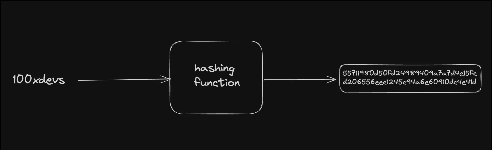
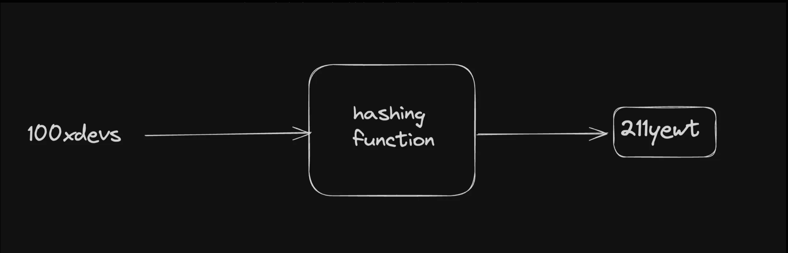
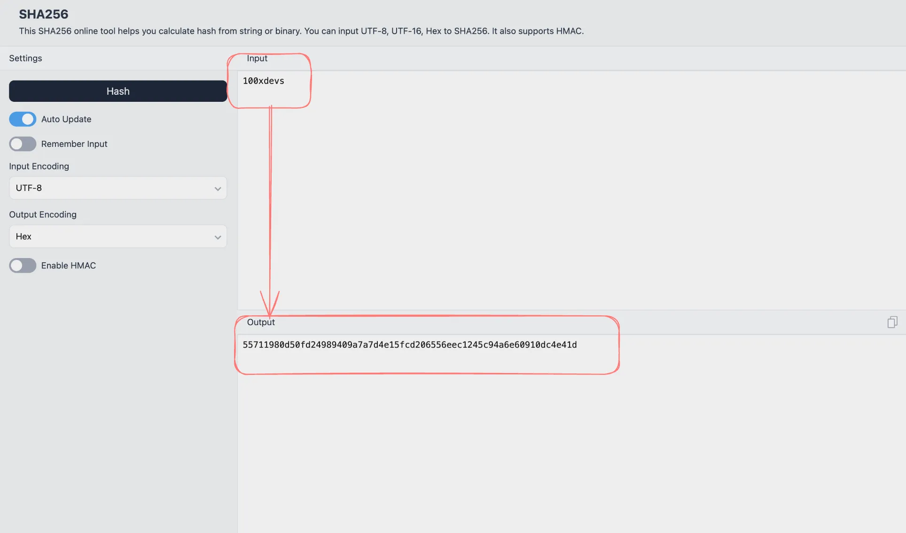

# 1.1 Orientation

## Why blockchains?

### Inflating currencies :

- Government has been printing currencies left right and center. This leads to increasing inflation, price of everything goes up.

- Holding on to cash is a losers bet in the long run. Holding on to any asset (Gold, Stock, real estate) is better compared to currencies like USD, INR.

### Fractional reserve Banking :

- Banks dont have your money. They lend out most of it.

- If there is a bank run (everyone goes to the bank to withdraw their money), banks wont be able to pay everyone.

### Bailouts :

- The 2008 Financial crisis was triggered by a financial instrument called mortgage-backed securities. 

- Even though the banks at Wall Street were at fault, the government ended up bailing them out using Taxpayer money.

## Intro to hashing :

**Hashing** is a process that transforms input data (of any size) into a fixed-size string of characters.
 
### Hash functions have several important properties :

- **Deterministic :** The same input will always produce the same output.

- **Fast computation :** The hash value can be quickly computed for any given data.

- **Pre-image resistance :** It should be computationally infeasible to reverse the hash function (i.e., find the original input given its hash output).

- **Small changes in input produce large changes in output :** Even a tiny change in the input should drastically change the hash output.

- **Collision resistance :** It should be computationally infeasible to find two different inputs that produce the same hash output.

### Is this a hashing algorithm?

What if I try “hashing” a string by increasing each alphabet’s value by one. Do you think this follows all the rules we’ve written above?

### SHA-256(32-bytes) :

Lets try out a famous hash function, SHA-256 here - https://emn178.github.io/online-tools/sha256.html

